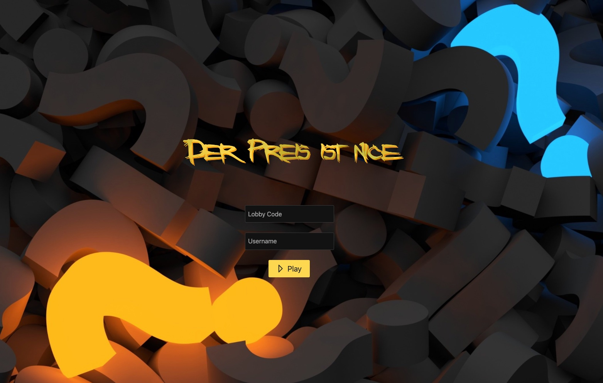
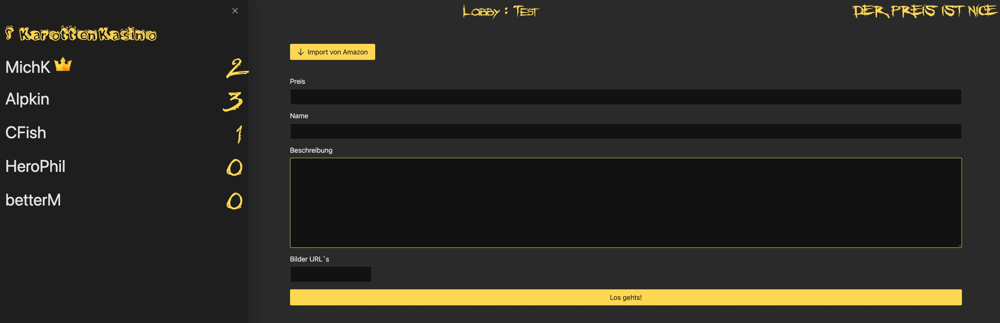
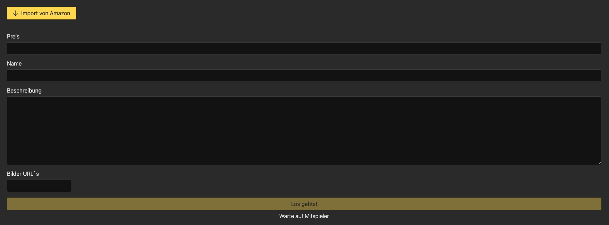
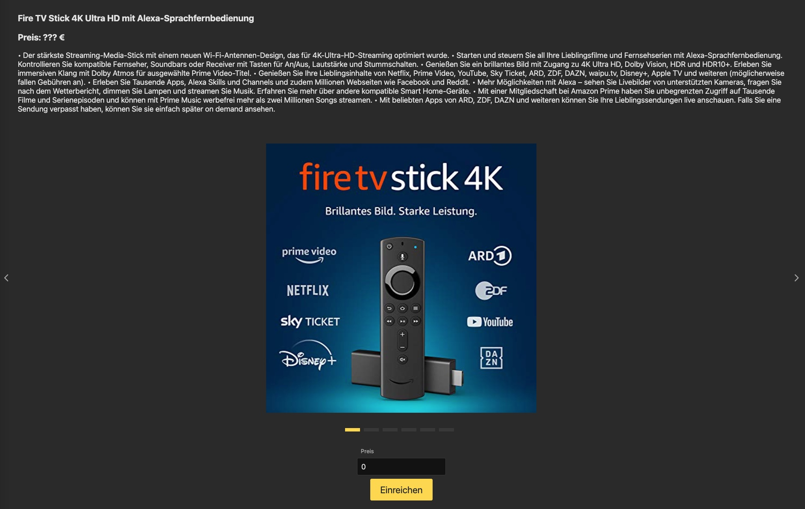
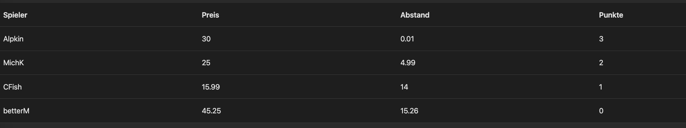

# Karotten Kasino

> Kein Kasino für Karotten, sondern von Karotten!

A student projekt using node, socket.io and angular.

Developed by *Karotten Kameraden*: Christian Bettermann | Christoph Fischer | Philip Herold | Michael Kaiser | Nicklas Platz

DHBW Mannheim - WWI19SEB

**[Try It Out!](https://kasino.karottenkameraden.de/)**

> There are more files for the project specification in this [Google Drive Folder](https://drive.google.com/drive/folders/1Q7mNMJRtU8z5j1ntx_IXsd-nLDsgmvxS). The folder includes: Product Vision Board, User Story Map, Requirements Engineering, Riskanalysis, Architectural Overview and other files.

---

## Games
Currently the Kasino features the following games:

### Price is nice
The price guessing multiplayer game based upon the video series by [pietsmiet](https://www.youtube.com/playlist?list=PL5JK9SjdCJp-lOboI8iBv81KH52QVWUVV).

You play with a group (of friends). Each round one of you is selected as "the babo". The babo chooses a product he presents to the rest of the group. Then everybody starts guessing what price he or she thinks the product costs. After everyone has guessed, points are given to the top three players who are closes to the real price of the product. An extra point is awarded if you manage to guess exactly the right price.

#### Top features
* easy lobby creation with custom joincode
* no log-in required
* use amazon links to directly import product information

#### Screenshots

---

## You are a developer?
Just run `npm run setup` in project root.
The contents of the folders named `backend` and `frontend` should be self explanatory.
Use `npm run preview` to build and run a local version on port 3000.
If your are interested in our experiences while developing (and speak german or can use the good old google translate tool) check out our [Lessons Learned](./LEARNINGS.md).

### Whats in the techstack?
The backend is build using a node.js typescript project. It's designed to run on an AWS Elastic Beanstalk environment.
The frontend is build around Angular using the [PrimeNG](https://www.primefaces.org/primeng/) UI design library.
The communication between client and server is implemented with [socket.io](https://socket.io/). This makes it easy to have different lobbies.
We currently host everything on AWS Elastic Beanstalk. All changes to the main branch will trigger a Code Pipeline and deploy this version to the production environment. This makes it available under [kasino.karottenkameraden.de](https://kasino.karottenkameraden.de/).
 

### About this project
This project is mostly meant to be a submission for a university task. This task was to build fancy a website with modern technology. We plan to improve on existing features and add more games in the future. But this will mostly stay a site project. If you have ideas feel free to share or just fork the project and implement them yourself. We do not have any financial interesses in this project. 
> NOTE: This project is licensed under the [GNU GENERAL PUBLIC LICENSE](./COPYING).
